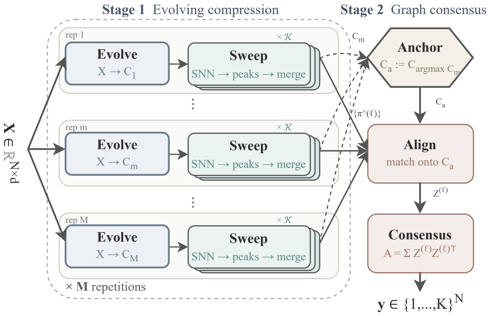
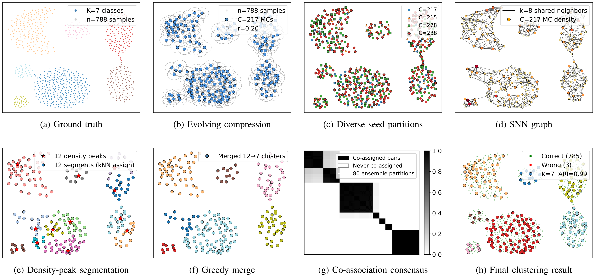

# EvoGC

M. Ožbot and I. Škrjanc, "Evolving Beyond Gaussian Prototypes with Multi-Scale Graph Consensus on Microclusters", IEEE EAIS 2026, Pisa.





```python
model = EvoGC(K=2, random_state=0).fit(X)
labels = model.pooled_row["labels"]
```
